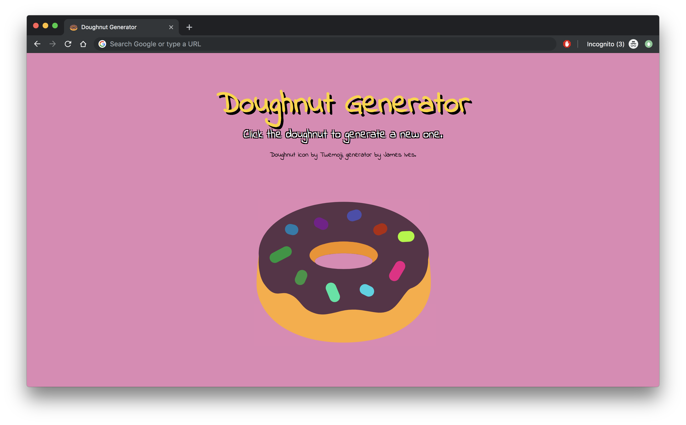

# Doughnut Generator 🍩
Dynamically generates a new Doughnut with every click.

## Installation Steps 💽

Simply clone the repository and open the `index.html` file. Alternatively you can view the application here.

## Credits 💬

Created using the [Twemoji](https://twemoji.twitter.com/) Donut icon, and [Github's Hexbot API](https://noopschallenge.com/challenges/hexbot) for their Meet the [NOOPS challenge](https://noopschallenge.com/).

